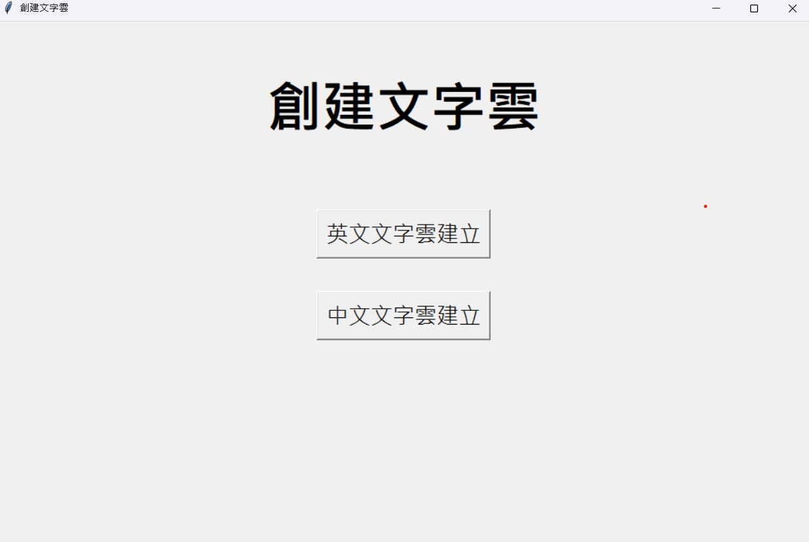
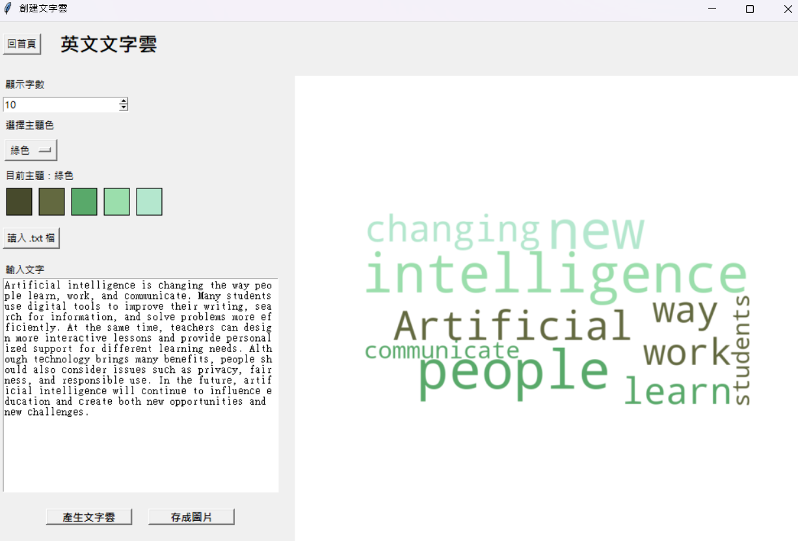

# hw2_wordcloud 建立文字雲GUI
## 功能
### 1. 英文文字雲

- 輸入英文或讀入純英文的文字檔(.text)
- 選擇輸入的內容裡面要有多少單詞放入文字雲
- 選擇文字雲的主題色
- 生成文字雲

### 2. 中文文字雲

- 輸入中文或讀入文字檔(.text)，可以有英文但不能全是英文
- 選擇輸入的內容裡面要有多少單詞放入文字雲
- 選擇文字雲的主題色
- 生成文字雲

## 我做的事

### 英文文字雲部分

- 英文文字雲處理文字的程式 (利用空格來分割出文字段落中的單詞)
- 將 GUI 設計想法告訴 chatGPT 請他幫我做初版
- 讀懂 GUI 程式的語法，並修改成我真正想要的樣子

### 中文文字雲部分

- 將 chatGPT 教我用 jieba 套件的部分，修改成能處理中文段落的 function
- 看過英文文字雲 GUI 頁面，試著自己寫中文文字雲 GUI 頁面(除了少數套件用的特殊函式，其他自己寫)

### 其他 GUI 功能相關

- 想一些特述情況要跳錯誤(ex: 英文文字雲輸入中文)
- 讓文字雲有多種顏色
- 在配色網站找適合放在一起的顏色其代號 (配色網站: https://coolors.co/)

## chatGPT 做的事

### 英文文字雲部分

- 一開始我只打算做英文的，所以寫了英文的文字處理，請 chatGPT 幫我加上 GUI 介面(一開始滿糟的)
- 介紹給我做文字雲的套件(wordcloud)

### 中文文字雲部分

- 介紹給我能分割中文單詞的套件(jieba)

### 其他部分

- GUI 遇到問題幫我找 bug

# 實際跑程式

## 首頁

- 能選擇要輸入中文或是英文文章段落做文字雲

## 英文文字雲

- 按回首頁能回去
- 可以選擇要放進文字雲的單詞有多少個
- 可以選主題色
- 按下``產生文字雲``來做文字雲
- 按下
